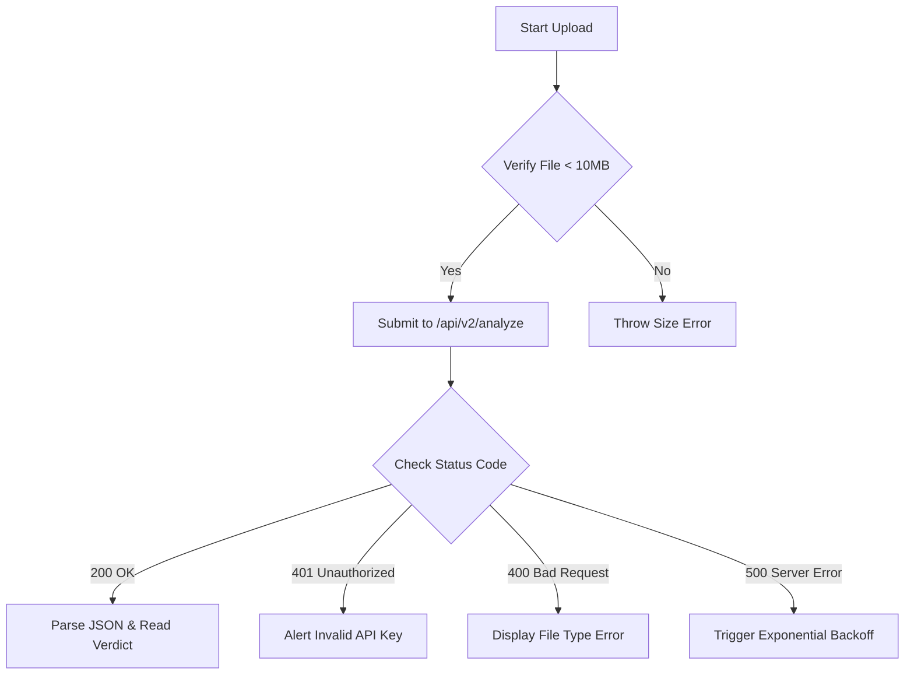

# AI Image Detector — SaaS API Developer Documentation

Welcome to the **AI Image Detector Developer Portal**. Our multi-signal forensic analysis API provides enterprise-grade detection capabilities, enabling developers to identify AI-generated and deepfake media at scale.

This API analyzes image metadata, JPEG compression structures (ELA & DCT), visual inconsistencies, micro-textures, Fourier grid artifacts, and neural network classifications (CLIP & pretrained ViTs) to deliver a definitive verdict and confidence level.

---

## 1. Introduction

### Overview
The AI Image Detector API offers production-ready endpoints for detecting synthetic media. By combining pixel-level forensics with state-of-the-art vision models, it remains robust against common platform modifications, including metadata removal, recompression, resizing, and screenshots (typical of sharing on Telegram, WhatsApp, Instagram, or Facebook).

### Key Features
*   **Dual-Path Classification:** Parallel detection pipelines for fully AI-generated images (e.g. Midjourney, DALL-E, Flux) and face manipulations (deepfakes).
*   **Compression Robustness:** Adaptive weights that automatically shift from metadata/PRNU forensics to semantic features (CLIP/ViT) when social media sharing strips headers.
*   **Granular Forensic Breakdown:** Returns analysis of ELA compression, fast Fourier transforms (FFT), LBP texture anomalies, and camera authenticities.
*   **Generative Tool Attribution:** Identifies the probable generating engine (e.g. Midjourney, OpenAI DALL-E 3, Stable Diffusion, or Adobe Firefly).
*   **Asynchronous Processing:** Support for background jobs on large or high-resolution images.

### Authentication
All requests must be authenticated using an API Key. Sign up on your developer portal dashboard to receive your key.
Include your key in the request headers:

```http
X-API-Key: your_secure_api_key_here
```

---

## 2. Quick Start Guide

Integrate AI detection into your application in three simple steps:

1.  **Obtain an API Key:** Sign up at the developer portal and copy your key.
2.  **Make a request:** Send a POST request to `/api/v2/analyze` with your image as `multipart/form-data`.
3.  **Read the verdict:** Process the structured JSON payload to trigger warnings or label uploads.

```bash
curl -X POST "http://localhost:8000/api/v2/analyze" \
  -H "X-API-Key: your_secure_api_key_here" \
  -F "file=@sample_image.jpg"
```

---

## 3. Endpoints

### 3.1. Analyze Image (v2 Recommendation)
Analyze an image using the hybrid 4-layer forensic and semantic pipeline.

*   **URL:** `/api/v2/analyze`
*   **Method:** `POST`
*   **Headers:**
    *   `X-API-Key`: `string` (Required)
    *   `Content-Type`: `multipart/form-data`
*   **Query Parameters:**
    *   `async_mode` (optional, boolean): If `true`, returns a `job_id` instantly and runs the execution in the background. Useful for avoiding HTTP timeouts.
*   **Request Body:**
    *   `file`: `binary` (Required, JPG, JPEG, PNG, WEBP. Max size: 10MB)

#### Success Response Schema (200 OK)
```json
{
  "success": true,
  "verdict": "AI_GENERATED",
  "confidence": 98.7,
  "prediction": "AI_GENERATED",
  "model": "v2.0",
  "labels": ["AI_GENERATED"],
  "camera_authenticity_likelihood": 10.0,
  "dual_detection": {
    "primary": "ai_generated",
    "ai_generated": {
      "score": 98.7,
      "likely_fake": true,
      "signals": ["hf_pretrained_model", "clip_semantic_ai", "generative_heuristic"]
    },
    "deepfake": {
      "score": 8.2,
      "likely_fake": false,
      "signals": [],
      "face_count": 0
    }
  },
  "ai_attribution": [
    { "tool": "OpenAI DALL-E 3", "confidence": 75 },
    { "tool": "Midjourney", "confidence": 15 },
    { "tool": "Stable Diffusion", "confidence": 10 }
  ],
  "breakdown": {
    "metadata_score": 100.0,
    "ela_score": 12.5,
    "ml_ensemble_score": 92.4,
    "frequency_score": 88.0,
    "pixel_forensics_score": 91.0,
    "deepfake_score": 8.2
  },
  "explanation": "This image is classified as likely AI-generated because we discovered explicit AI generator signatures in the EXIF tags, its Fourier frequency spectrum contains highly artificial, repeating grid peaks indicating convolutional upsampling artifacts, and the statistical fusion of frequency, noise, and compression grids strongly points to synthetic rendering."
}
```

#### Async Submission Response (200 OK)
```json
{
  "success": true,
  "job_id": "8fa84f7b-6c4a-4e4c-b2dc-0150c79645ba",
  "status": "processing",
  "poll_url": "/api/v2/jobs/8fa84f7b-6c4a-4e4c-b2dc-0150c79645ba"
}
```

### 3.2. Poll Asynchronous Job
Check the status of a background analysis job submitted with `async_mode=true`.

*   **URL:** `/api/v2/jobs/{job_id}`
*   **Method:** `GET`
*   **Headers:**
    *   `X-API-Key`: `string` (Required)
*   **Path Parameters:**
    *   `job_id`: `string` (Required, UUID of the background job)

#### Success Response Schema - Completed (200 OK)
Returns the completed analysis payload:
```json
{
  "success": true,
  "job_id": "8fa84f7b-6c4a-4e4c-b2dc-0150c79645ba",
  "status": "completed",
  "result": {
    "verdict": "AI_GENERATED",
    "confidence": 98.7,
    "prediction": "AI_GENERATED",
    "model": "v2.0"
    // ... rest of the standard v2 response payload
  }
}
```

#### Response Schema - Processing (200 OK)
```json
{
  "success": true,
  "job_id": "8fa84f7b-6c4a-4e4c-b2dc-0150c79645ba",
  "status": "processing"
}
```

---

## 4. Response & Error Examples

The API uses standard HTTP response codes to indicate success or failure.

### Success Response Example
```json
{
  "success": true,
  "confidence": 98.7,
  "prediction": "AI_GENERATED",
  "model": "v2.0",
  "verdict": "AI_GENERATED"
}
```

### Error Responses

#### 400 Bad Request — Unsupported File Format
```json
{
  "success": false,
  "error": "Unsupported File Format",
  "detail": "Unsupported file format .gif. Supported formats: JPG, JPEG, PNG, WEBP."
}
```

#### 400 Bad Request — File Too Large
```json
{
  "success": false,
  "error": "File Too Large",
  "detail": "File is too large. Maximum allowed size is 10MB."
}
```

#### 401 Unauthorized — Invalid API Key
```json
{
  "success": false,
  "error": "Invalid API Key",
  "detail": "Provided X-API-Key is invalid or has been revoked."
}
```

#### 404 Not Found — Job ID Missing
```json
{
  "success": false,
  "error": "Job Not Found",
  "detail": "The requested job_id does not exist or has expired (jobs expire after 24 hours)."
}
```

#### 500 Internal Server Error — Analysis Failed
```json
{
  "success": false,
  "error": "Analysis Failed",
  "detail": "An error occurred during multi-signal forensic analysis: PyTorch model timeout."
}
```

---

## 5. SDK & Code Examples

### 5.1. cURL
```bash
curl -X POST "http://localhost:8000/api/v2/analyze" \
  -H "X-API-Key: your_api_key" \
  -F "file=@/path/to/image.jpg"
```

### 5.2. JavaScript (Browser)
```javascript
async function analyzeImage(fileObject) {
  const url = "http://localhost:8000/api/v2/analyze";
  const formData = new FormData();
  formData.append("file", fileObject);

  try {
    const response = await fetch(url, {
      method: "POST",
      headers: {
        "X-API-Key": "your_api_key"
      },
      body: formData
    });

    if (!response.ok) {
      const err = await response.json();
      throw new Error(err.detail || "Analysis failed");
    }

    const data = await response.json();
    console.log(`Verdict: ${data.verdict}, Confidence: ${data.confidence}%`);
    return data;
  } catch (error) {
    console.error("SDK Error:", error.message);
  }
}
```

### 5.3. Node.js (Axios + Form-Data)
```javascript
const axios = require("axios");
const FormData = require("form-data");
const fs = require("fs");

async function analyzeImageNode(filePath) {
  const url = "http://localhost:8000/api/v2/analyze";
  const form = new FormData();
  form.append("file", fs.createReadStream(filePath));

  try {
    const response = await axios.post(url, form, {
      headers: {
        ...form.getHeaders(),
        "X-API-Key": "your_api_key"
      },
      timeout: 120000 // 2-minute timeout for CPU-intensive models
    });

    const data = response.data;
    console.log(`Verdict: ${data.verdict}, Confidence: ${data.confidence}%`);
    return data;
  } catch (error) {
    const errorDetails = error.response ? error.response.data : error.message;
    console.error("SDK Error:", errorDetails);
  }
}
```

### 5.4. Python (Requests)
```python
import requests

def analyze_image(file_path, api_key):
    url = "http://localhost:8000/api/v2/analyze"
    headers = {"X-API-Key": api_key}
    
    try:
        with open(file_path, "rb") as f:
            files = {"file": (file_path, f, "image/jpeg")}
            response = requests.post(url, headers=headers, files=files, timeout=120)
            
        response.raise_for_status()
        data = response.json()
        print(f"Verdict: {data['verdict']}, Confidence: {data['confidence']}%")
        return data
    except requests.exceptions.RequestException as e:
        print(f"SDK Error: {e}")
        return None
```

### 5.5. PHP (cURL)
```php
<?php
function analyzeImage($filePath, $apiKey) {
    $url = "http://localhost:8000/api/v2/analyze";
    $ch = curl_init($url);
    
    $file = new CURLFile($filePath, "image/jpeg", basename($filePath));
    
    curl_setopt_array($ch, [
        CURLOPT_POST => true,
        CURLOPT_POSTFIELDS => ["file" => $file],
        CURLOPT_RETURNTRANSFER => true,
        CURLOPT_TIMEOUT => 120,
        CURLOPT_HTTPHEADER => [
            "X-API-Key: " . $apiKey
        ]
    ]);
    
    $response = curl_exec($ch);
    if (curl_errno($ch)) {
        throw new Exception("cURL Error: " . curl_error($ch));
    }
    curl_close($ch);
    
    $data = json_decode($response, true);
    echo "Verdict: " . $data["verdict"] . ", Confidence: " . $data["confidence"] . "%\n";
    return $data;
}
?>
```

### 5.6. Java (OkHttp)
```java
import okhttp3.*;
import java.io.File;
import java.io.IOException;

public class AIDetector {
    public static void main(String[] args) throws IOException {
        String apiKey = "your_api_key";
        File file = new File("/path/to/image.jpg");

        OkHttpClient client = new OkHttpClient().newBuilder().build();
        RequestBody body = new MultipartBody.Builder().setType(MultipartBody.FORM)
            .addFormDataPart("file", file.getName(),
                RequestBody.create(MediaType.parse("image/jpeg"), file))
            .build();

        Request request = new Request.Builder()
            .url("http://localhost:8000/api/v2/analyze")
            .method("POST", body)
            .addHeader("X-API-Key", apiKey)
            .build();

        try (Response response = client.newCall(request).execute()) {
            if (!response.isSuccessful()) throw new IOException("Unexpected code " + response);
            System.out.println(response.body().string());
        }
    }
}
```

### 5.7. C# (.NET HttpClient)
```csharp
using System;
using System.IO;
using System.Net.Http;
using System.Threading.Tasks;

class Program
{
    static async Task Main()
    {
        string apiKey = "your_api_key";
        string filePath = "image.jpg";
        string url = "http://localhost:8000/api/v2/analyze";

        using var client = new HttpClient();
        client.DefaultRequestHeaders.Add("X-API-Key", apiKey);

        using var content = new MultipartFormDataContent();
        using var fileStream = File.OpenRead(filePath);
        using var streamContent = new StreamContent(fileStream);
        
        content.Add(streamContent, "file", Path.GetFileName(filePath));

        var response = await client.PostAsync(url, content);
        var resultJson = await response.Content.ReadAsStringAsync();
        Console.WriteLine(resultJson);
    }
}
```

### 5.8. Go (net/http)
```go
package main

import (
	"bytes"
	"fmt"
	"io"
	"mime/multipart"
	"net/http"
	"os"
	"path/filepath"
)

func analyzeImage(filePath, apiKey string) error {
	url := "http://localhost:8000/api/v2/analyze"
	
	file, err := os.Open(filePath)
	if err != nil {
		return err
	}
	defer file.Close()

	body := &bytes.Buffer{}
	writer := multipart.NewWriter(body)
	part, err := writer.CreateFormFile("file", filepath.Base(filePath))
	if err != nil {
		return err
	}
	if _, err = io.Copy(part, file); err != nil {
		return err
	}
	writer.Close()

	req, err := http.NewRequest("POST", url, body)
	if err != nil {
		return err
	}
	req.Header.Set("Content-Type", writer.FormDataContentType())
	req.Header.Set("X-API-Key", apiKey)

	client := &http.Client{}
	resp, err := client.Do(req)
	if err != nil {
		return err
	}
	defer resp.Body.Close()

	respBody, _ := io.ReadAll(resp.Body)
	fmt.Println(string(respBody))
	return nil
}
```

### 5.9. Ruby (Net::HTTP)
```ruby
require 'net/http'
require 'net/http/post/multipart'

url = URI.parse('http://localhost:8000/api/v2/analyze')
file_path = 'image.jpg'
api_key = 'your_api_key'

File.open(file_path) do |jpg|
  req = Net::HTTP::Post::Multipart.new(
    url.path,
    'file' => UploadIO.new(jpg, 'image/jpeg', File.basename(file_path))
  )
  req.add_field('X-API-Key', api_key)
  
  res = Net::HTTP.start(url.host, url.port) do |http|
    http.request(req)
  end
  
  puts res.body
end
```

---

## 6. SDK Installation & Integration Guide

To integrate the AI Image Detector smoothly, we provide pre-packaged SDKs and recommend standard error-handling architectures.

### Installing SDKs
```bash
# Node.js SDK
npm install ai-image-detector-sdk

# Python SDK
pip install ai-image-detector

# Go Module
go get github.com/aidetector/sdk-go
```

### Basic Error Handling Architecture
When uploading large images, your integrations should account for the following lifecycle:



### Rate Limiting
To ensure high availability, the API enforces a rate limit on standard accounts:
*   **Rate Limit:** 60 requests per minute per IP or API Key.
*   **Limit Exceeded Headers:** If you exceed the rate limit, the API returns an HTTP `429 Too Many Requests` status code with the following response headers:
    *   `X-RateLimit-Limit`: Maximum requests allowed (60).
    *   `X-RateLimit-Remaining`: Remaining request allowance in current window (0).
    *   `X-RateLimit-Reset`: Unix timestamp when the limit resets.

---

## 7. Additional Sections

### FAQ
*   **Q: How does the API handle messaging compressed JPEGs?**  
    **A:** The API detects EXIF removal and JPEG block structures. It automatically adapts by down-weighting hardware-dependent tests (EXIF/PRNU noise) and prioritizing semantic architectures (CLIP and pre-trained ViTs) which examine macro-structures.
*   **Q: Can we run detection on videos?**  
    **A:** Video deepfake scanning is supported under our Enterprise package. Contact support for access.
*   **Q: Where are the pre-trained weights stored?**  
    **A:** Local models are fetched at boot and cached in `.cache/huggingface/` and local backend registry models.

### API Versioning
*   **Current Version:** `v2.0` (Active).
*   **Legacy Version:** `v1.0` (Deprecated, served at `/api/analyze` for backward compatibility, mapped to v2 pipeline internally).
*   API paths incorporate versioning explicitly: `/api/v2/...`. Backward breaking changes trigger an incremental version bump (`/api/v3/...`).

### Webhooks
For high-volume async tasks, register a webhook URL in your developer dashboard. Once a job completes, our servers will dispatch a `POST` request to your registered webhook with the completed analysis body:

```json
{
  "event": "analysis.completed",
  "job_id": "8fa84f7b-6c4a-4e4c-b2dc-0150c79645ba",
  "timestamp": 1779836400,
  "result": {
    "verdict": "AI_GENERATED",
    "confidence": 98.7
  }
}
```

### Best Practices & Security Recommendations
1.  **Do Not Expose API Keys in Client-Side Code:** Never place your `X-API-Key` in browser-based Javascript or public code repositories. Always proxy requests through your own backend server.
2.  **Verify Content-Type Headers:** Ensure your upload scripts explicitly define the correct boundary and MIME type (`image/jpeg`, `image/png`, or `image/webp`).
3.  **Implement Timeouts:** Because multi-signal DL models are resource-heavy, set network client timeouts to a minimum of 90 seconds.

### Terms of Service & Terms of Use
*   **Permitted Use:** The API may be used to verify image authenticity, moderate content uploads, and audit synthetic media distribution.
*   **Prohibited Use:** Scraping or reverse-engineering model parameters by submitting millions of continuous perturbations is strictly prohibited and will result in API key revocation.
*   **Privacy:** Uploaded images are analyzed in-memory and are immediately deleted. No uploaded media is persisted on our servers or used for model training without explicit consent.
